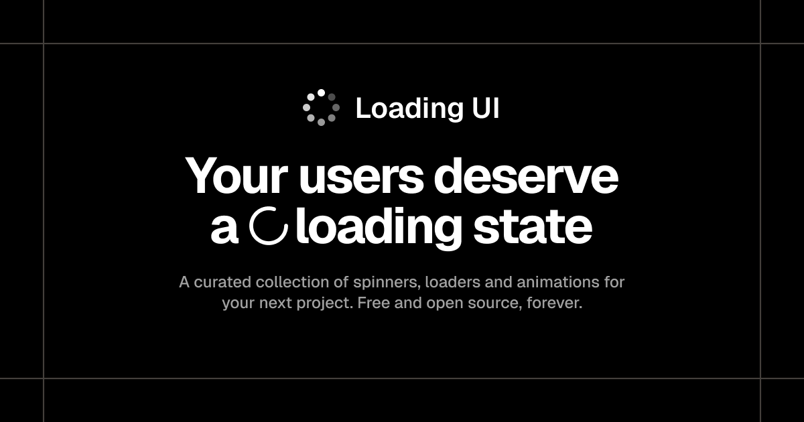

<h3 align="center">Loading UI</h3>

    Spinners, loaders and loading animations for modern web apps.

  
  
  
  
  

## Documentation

Visit https://loading-ui.com/docs to view the documentation.

## Contributing

Visit our [contributing guide](https://github.com/turbostarter/loading-ui/blob/main/.github/CONTRIBUTING.md). It only takes ~5 minutes to add your own component!

## Community

Have questions, comments or feedback? [Join our Discord](https://discord.gg/KjpK2uk3JP).

## Authors

## Star History

## License

Licensed under the [MIT license](https://github.com/turbostarter/loading-ui/blob/main/LICENSE.md).
